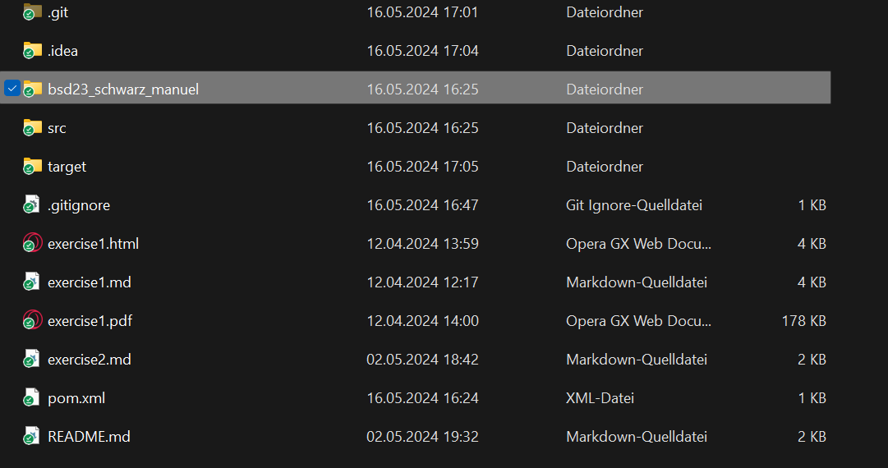
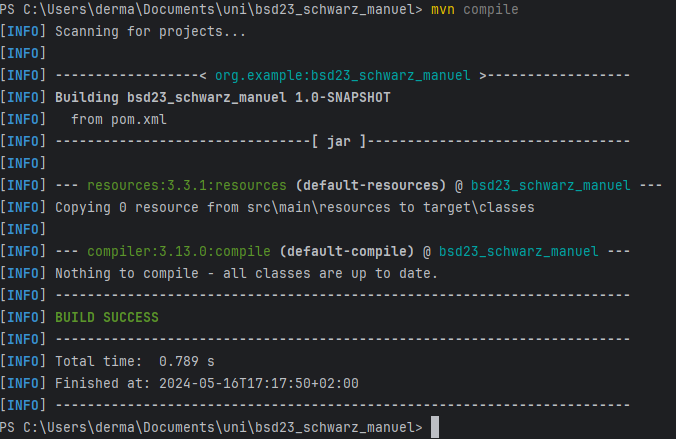
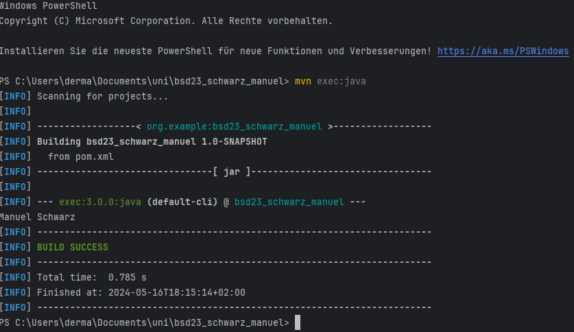

# excercise3
**
The "target" folder was added after the first execution

Basically, I did quite well with the submission.

I worked through the assignment sheet sequentially until I reached "mvn exec:java". Because for some reason, I was using a 1.8 JRE. It took me about 45 minutes to fix my mistake in the PATH variable. However, I didn't have any problems with the "actual" work.